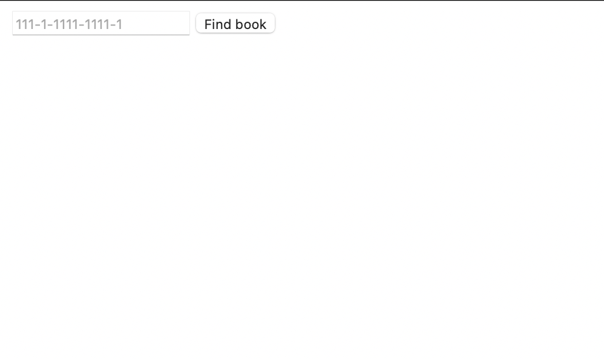
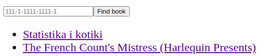

# library

## User documentation

#### Description

This is the library management application whose goal is to make it easier for users to keep and exchange books
 
Features of this web application:

1. User can borrow book
2. User can add book
3. User can sell book
4. User can rate book

#### Web site
To check the web site go to http://34.217.9.107:8080
#### Manual installation

You need to install frontend and backend part to obtain a working project.

Firstly clone this repo

```git clone https://github.com/Moiiwa/library.git```

Frontend is written in React.js

```
cd front  

npm install --legacy-peer-deps 

npm npm start  
```

Backend is written with Spring

```
cd library-Backend 

mvn clean install packages  

cd target 

java -jar <JAR_NAME> 
```
In case you want to run backend in Docker, you have to use the next commands

```
cd library-Backend 

mvn clean install package -DskipTests 

docker build -t moiwa/library_server .

docker-compose up                     
```

#### User manual

You need to write the book's isbn with numbers and dashes and click find button  



If the format of isbn is correct and such book is found you will get following page



By clicking on the book name from the list you will get the book page with detailed information


On this page you can set up the selling and sharing status to allow other user to borrow or buy your book

## Process organisation
#### Team
- Daniyar Galimzhanov - frontend
- Anna Gorb - frontend
- Mikhail Gudkov - backend

#### Branching policy
Developer Branch Workflow - all work in progress is in different branches, but then will be merged to main

#### Tools
- Backend - Spring
- Frontend - React
- CI - Docker, AWS

## Product Backlog

#### User stories -> Tasks

User story number | User story | Task | Status
| --- | --- | --- | --- |
[#2](https://github.com/Moiiwa/Library/issues/2) | As a book owner I want to be able to share books | Add to book share status check ability | Done |
[#3](https://github.com/Moiiwa/Library/issues/3) | As a book owner I want to be able to add new books | Create the book card | Done |
[#4](https://github.com/Moiiwa/Library/issues/4) | As a book owner I want perform as few steps as possible to add new book | Add ability to identify book with Isbn | Done |
[#5](https://github.com/Moiiwa/Library/issues/5) | As a client I want to be able to borrow books | Create an ability to notify the owner about the borrow wish | |
[#6](https://github.com/Moiiwa/Library/issues/6) | As a client I want to be reminded when I should return book to owner | Create an ability to notify the client about the return day | |
[#7](https://github.com/Moiiwa/Library/issues/7) | As a book owner I want to get feedback about my books from other users | Add an ability to left feedback | |
[#8](https://github.com/Moiiwa/Library/issues/8) | As a book owner I want to be able to sell books | Add to book sell status check ability | Done |
[#9](https://github.com/Moiiwa/Library/issues/9) | As a user I want to be able to send and approve friend requests | Add users authentification and authorization modules | |
[#9](https://github.com/Moiiwa/Library/issues/9) | | Add ability to add friends |  |

#### Sprints -> Tasks

Sprints | Tasks |
| --- | --- | 
Sprint 1 |  | 
| | Add ability to identify book with Isbn | 
| | Create the book card| 
Sprint 2 |  | 
| | Add to book share status check ability | 
| | Add to book sell status check ability | 
| | Create the CI |
Sprint 3 |  | 
| | Add users authentification and authorization modules | 
Sprint 4 |  | 
| | Create an ability to notify the owner about the borrow wish | 
| | Create an ability to notify the client about the return day |
| | Add an ability to left feedback |
Sprint 5 |  | 
| | Add ability to add friends | 

#### Sprint 1

Task | Small tasks | Acceptance tests | Status |
| --- | --- | --- | --- |
Sprint 1 |  |  |  |
| Add ability to identify book with Isbn | Create the Isbn search field in frontend | Tests coverage at least 80% | Done |
|  | Connect the scaner with the database of Isbns | It detects 20% of example books |  Done |
| Create the book card | Save information about the book in db | All create/read operations work | Done |
|  | Display info from db on the book page | Title and Author should be filled | Done |

#### Sprint 2

Task | Small tasks | Acceptance tests | Status |
| --- | --- | --- | --- |
Sprint 2 |  |  |  |
| Add to book share status check ability | Connect list of books with get endpoint | All books after isbn search are displayed in the list | Done |
|  | Connect get book api with book page | Display book page after click on book name | Done |
|  | Create share check box on the book page | Check box is clickable | Done |
| Add to book sell status check ability | Create put endpoint for book with sell and share status update | sell status changes in bd | Done |
|  | Create sell check box on the book page | Check box is clickable | Done |
| Create the CI | Dockerize everything | App starts from docker | Done |

