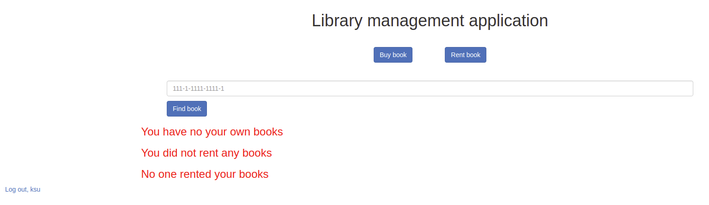
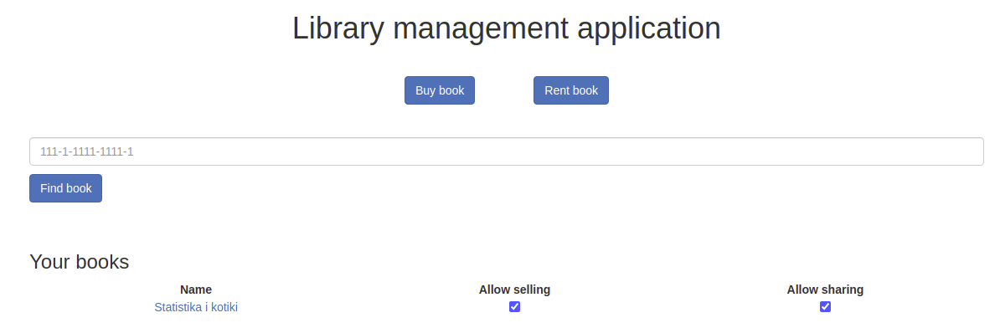

# Library management app

#### Description

This is the library management application whose goal is to make it easier for users to keep and exchange books
 
Features of this web application:

1. User can borrow book
2. User can add book
3. User can sell book
4. User can rate book

#### Web site
To check the web site go to http://34.217.9.107:8080
#### User manual

First page which you will see is registration page. You need to fill each field to register.

In case of empty field you will have an error notification.

If you already have an account, you can switch to login page by clicking on "Cancel" button at the bottom of the registration page.

If on the login page you will enter credentional which do not exist in the database, you will get the error like on the picture above.

After successful login or registration you will see the main page.

You can write the book's isbn with numbers and dashes and click find button to find the book. If you already have some books in your library, you will see the list of them.

By clicking on the book name from the list you will get the book page with detailed information

On this page you can set up the selling and sharing status to allow other user to borrow or buy your book. Also you can use the same checkboxes from the main page - in the same row with the book title.

Also you can see "buy book" button on the main page. By clicking on it you will see the page with all books available for buying.

If you will click on the "Buy book" button here - this book will disappear from the list of available for sale and will appear in the list of your own books on the main page.

Also there is a "Rent book" page near to the "Buy book" button. By clicking on it you will see all books, awailable for renting.

After you will chose some books from this list, it will appear in the list of your rented books on the main page:

By clicking on the "Return book" you will return the book to the owner and it will disappear from your rented books list.

Also, on the main page, there is the last list of books - list of your books which are in use by other people.

You can click on the "Ask to return" button to return your book.

To log out from the app click "log out" button on the main page

## Manual installation

for manual installation check [here](https://github.com/Moiiwa/Library/blob/front_ci/documentation/manual-instalation.md)

## Application architecture

for application architecture check [here](https://github.com/Moiiwa/Library/blob/front_ci/documentation/architecture.md)

## Process organisation

for process organisation check [here](https://github.com/Moiiwa/Library/blob/front_ci/documentation/process-organisation.md)

## Product Backlog

for product backlog check [here](https://github.com/Moiiwa/Library/blob/front_ci/documentation/product-backlog.md)