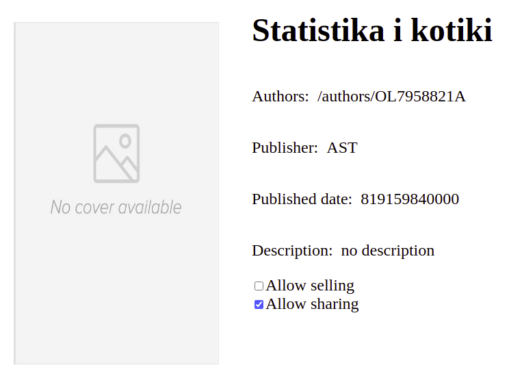

# Library management app

#### Description

This is the library management application whose goal is to make it easier for users to keep and exchange books
 
Features of this web application:

1. User can borrow book
2. User can add book
3. User can sell book
4. User can rate book

#### Web site
To check the web site go to http://34.217.9.107:8080
#### User manual

You need to write the book's isbn with numbers and dashes and click find button  

If the format of isbn is correct and such book is found you will get following page

By clicking on the book name from the list you will get the book page with detailed information

On this page you can set up the selling and sharing status to allow other user to borrow or buy your book

## Manual installation

for manual installation check [here](https://github.com/Moiiwa/Library/blob/front_ci/documentation/manual-instalation.md)

## Application architecture

for application architecture check [here](https://github.com/Moiiwa/Library/blob/front_ci/documentation/architecture.md)

## Process organisation

for process organisation check [here](https://github.com/Moiiwa/Library/blob/front_ci/documentation/process-organisation.md)

## Product Backlog

for product backlog check [here](https://github.com/Moiiwa/Library/blob/front_ci/documentation/product-backlog.md)