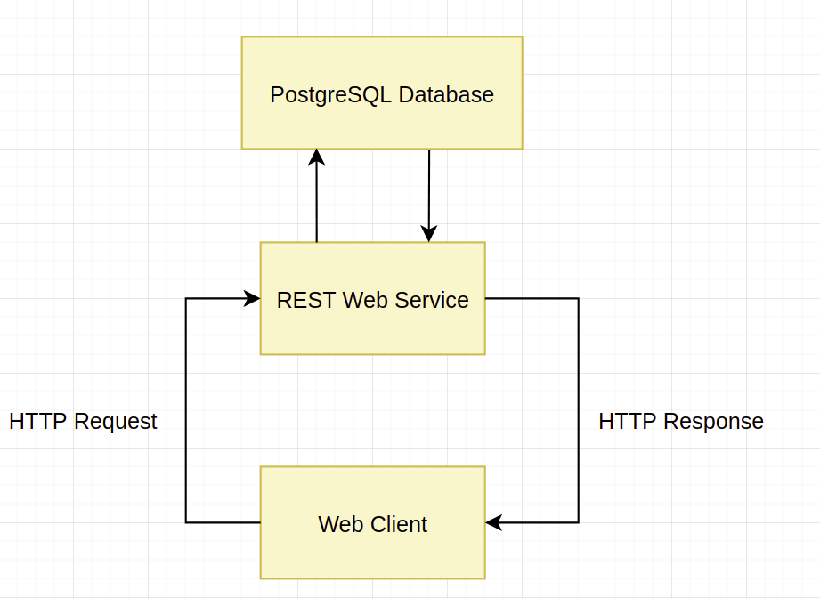

## Application architecture

#### Overall architecture

#### Code architecture

*front*
- api: api to interact with backend
- app: main file of the app
- components: reusable components for pages
- components/__tests__: tests for components
- pages: compositions of components
- pages:__tests__: tests for pages

*Library-Backend/src/main/java*
- controllers: 
- dto:
- entities:
- repositories:
- services:

*Library-Backend/src/test*
- BookControllerTest: tests for all apis